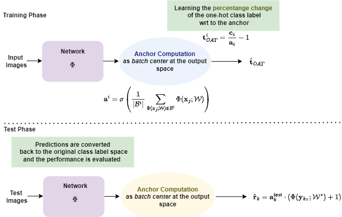

# Online Anchor-based Training for Image Classification Tasks



## Dataset

[BAR](https://github.com/alinlab/BAR)

## Pretrained Weights

[EfficientNet@10epochs](https://drive.google.com/drive/folders/1gjJSriJWlEnxpttBKiuQbZDJKVqESVYu?usp=sharing)

## Training and Evaluation
- OAT training and evaluation
```bash
python3 oat_efficientnet.py --nof_epochs 90 --l_r 0.001 --batch_size 32 --nof_classes 6 --pretrained True --weights_path /path/to/efficient10.pth
```

- Baseline training and evaluation
```bash
python3 baseline_efficientnet.py --nof_epochs 100 --l_r 0.001 --batch_size 32 --nof_classes 6
```

## Evaluation Results
Evaluation results in terms of test accuracy (%) of the OAT method (with and without pretraining) against baseline, using the EfficientNet-b1 model (5 runs).

| Method | BAR | 
| -------------| ------------- |
| Baseline  |  67.278 |
| OAT w/o pretraining |  **68.593**  | 
| OAT w pretraining |  **69.174**  | 


## Acknowledgements
This project has been funded by the European Union as part of the Horizon Europe Framework Program, under grant agreement 101070109 (TransMIXR).

## License
This code is provided for academic, non-commercial use only. Please also check for any restrictions applied in the code parts and datasets used here from other sources. For the materials not covered by any such restrictions, redistribution and use in source and binary forms, with or without modification, are permitted for academic non-commercial use provided that the following conditions are met:

Redistributions of source code must retain the above copyright notice, this list of conditions and the following disclaimer. Redistributions in binary form must reproduce the above copyright notice, this list of conditions and the following disclaimer in the documentation provided with the distribution. 

This software is provided by the authors "as is" and any express or implied warranties, including, but not limited to, the implied warranties of merchantability and fitness for a particular purpose are disclaimed. In no event shall the authors be liable for any direct, indirect, incidental, special, exemplary, or consequential damages (including, but not limited to, procurement of substitute goods or services; loss of use, data, or profits; or business interruption) however caused and on any theory of liability, whether in contract, strict liability, or tort (including negligence or otherwise) arising in any way out of the use of this software, even if advised of the possibility of such damage.


## Citation
If you find our method useful in your work or you use some materials provided in this repo, please cite the following publication where our method and materials were presented: 

DOI: https://doi.org/10.1109/ICIP51287.2024.10648148

Pre-print: http://arxiv.org/abs/2406.12662

````
@inproceedings{tzelepi2024online,
    title={Online Anchor-based Training for Image Classification Tasks},
    author={Tzelepi, Maria and Mezaris, Vasileios},
    year={2024},
    booktitle={Proc. 2024 IEEE International Conference on Image Processing (ICIP 2024)}
}
````
